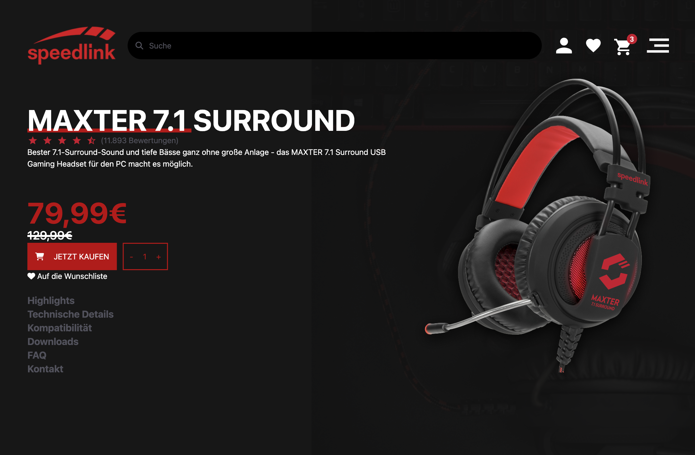
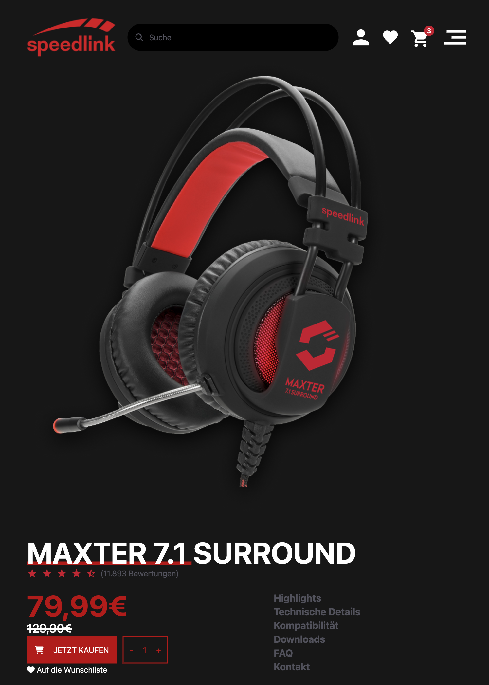
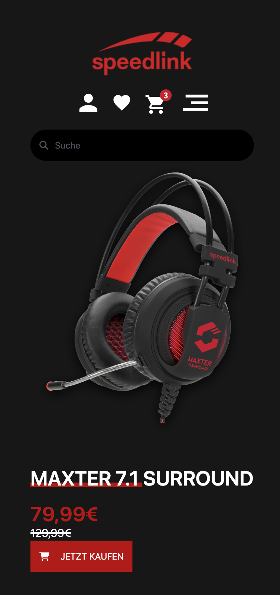

# 🎧 Projeto Final - Fone Maxter

## Sobre o Projeto

Este projeto é uma landing page desenvolvida para apresentar o **Fone MAXTER 7.1 Surround**, um headset com som imersivo e design moderno. A proposta foi criar uma página **100% responsiva**, que se adapta perfeitamente a **desktops, tablets e celulares**, garantindo uma boa experiência em qualquer dispositivo.

O layout para desktop foi fornecido pela equipe do cliente, enquanto as versões para tablet e mobile foram prototipadas por mim no Figma, respeitando a identidade visual original, mas reorganizando os elementos para facilitar a navegação em telas menores.

A página está publicada no **GitHub Pages**, e você pode acessá-la facilmente clicando [aqui](https://gpereiraaa.github.io/projetoFinalFoneMaxter/).

---

## 🧩 Protótipos no Figma

Criei os protótipos para dispositivos móveis com os seguintes cuidados:

- Manter o visual e o estilo definidos pelo cliente.
- Adaptar o conteúdo para leitura e uso em telas menores.
- Garantir que o site fosse acessível e funcional em dispositivos touch.

👉 [Acesse o protótipo no Figma](https://www.figma.com/design/4v4zjjowtP5L1DgBVAOSEM/atividade-LIMA-Final?node-id=0-1&t=IOKcXDhtVmqsEEdH-1)

---

## 🛠️ Tecnologias Utilizadas

- **HTML5** – Estrutura semântica do conteúdo.
- **Tailwind CSS** – Estilização rápida e responsiva com classes utilitárias.
- **Font Awesome** – Ícones visuais como carrinho, coração, usuário, entre outros.
- **Figma** – Criação dos protótipos responsivos.
- **GitHub Pages** – Hospedagem gratuita para o projeto ficar online.

---

## 🗂️ Estrutura do Projeto

```
fone-maxter/
├── index.html          # Página principal
├── style.css           # Pequeno detalhe
├── README.md           # Este arquivo :)
└── img/                # Imagens utilizadas no site
    ├── img-mobile.png
    ├── img-tablet.png
    ├── img-desktop
    ├── logo_empresa.svg
    ├── background-fundo.svg
    ├── headset.png
    ├── icon_user.svg
    ├── icon_coracao.svg
    ├── icon_carrinho.svg
    ├── icon_hamburguer.svg
    ├── icon-avaliacao.svg
    └── icon-avaliacao-metade.svg
```

---

## 🖼️ Alguns exemplos do site

### 💻 Versão Desktop


### 📱 Versão Tablet


### 📲 Versão Mobile


---

## 🔗 Acesse o site facilmente

O projeto está online!  
👉 [Clique aqui para visitar a página](https://gpereiraaa.github.io/projetoFinalFoneMaxter/)

---

## ✍️ Considerações Finais

Esse projeto foi uma ótima oportunidade para colocar em prática meus conhecimentos de **desenvolvimento web**, principalmente no uso da biblioteca **Tailwind CSS** para substituir o CSS. Também trabalhei com **Figma** para criar layouts adaptáveis e garantir que a experiência do usuário fosse consistente em qualquer dispositivo.

Além disso, utilizei o **GitHub** tanto para versionar o código quanto para publicar o site, o que mostra o cuidado em manter um fluxo de trabalho completo e organizado.

---

## 👨‍💻 Sobre mim

Desenvolvido por **Gustavo Pereira Leite da Silva**  

Técnico em Redes de computadores

Estudante de Desenvolvimento de sistemas

📧 E-mail: guga20.leite@gmail.com  

🌐 [LinkedIn](https://www.linkedin.com/in/gustavo-pereira-dev-redes/)  

🌐 [GitHub](https://github.com/gpereiraaa)
